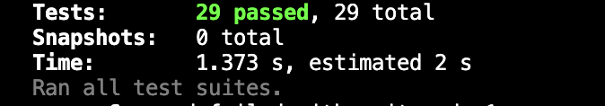

# Oxbury Pathfind

Imagine representing a grid-shaped game map as a 2-dimensional array. Each value of this array is
boolean `true` or `false` representing whether that part of the map is passable (a floor) or blocked
(a wall).

Write a function that takes such a 2-dimensional array `A` and 2 vectors `P` and `Q` each represented by the `Vector` type found in `src/Vector.type.ts`, with `0,0` being the top left corner of the map (in the example below, `P = { x: 1, y: 0 }` and `Q = { x: 2, y: 3 }`), and returns the distance of the shortest path between those points, respecting the walls in the map.

eg. Given the map (where `.` is passable - `true`, and `#` is blocked - `false`)

```
.P...
.###.
.....
..Q..
.....
```

then `pathfind(A, P, Q)` should return `6`.

## What to do

1. Clone/Fork this repo
2. Implement the `pathfind` function in `src/pathfind.ts`
3. Feel free to add further test cases to `tests/pathfind.test.ts`

## Running the tests

Tests have been implemented using Jest and can be run by running `yarn test`.

## Comments Section

Please fill in the sections below after you complete the challenge.

### What I'm Pleased With

1. The clearness, readability and code organization of the function
2. The efficiency, since i was able to run a test for a 1000\*1000 matrix in less than 0.5 seconds. Time complexity: O(m*n) and space complexity of O(m * n)
3. The test coverage, which ensures the robustness of my solution

- Tests

  

- Algorithm: BFS

  

### What I Would Have Done With More Time

I would have liked to build a front end UI to display how the algorithm works visually.Which I have done in the past, but with sorting algorithms.
Additionally, implementing other solutions would be interesting. E.g. A\* or Dijkstra's.
Although these algorithms might not have a significant impact on this specific scenario, where the movement between vectors takes the same weight, they could provide valuable insights and comparisons for different use cases.

#### What I would do to make it cleaner

It would be a good idea to implement this function as a method inside a class. Since, this would take advantage of typescript "OOP" functionality e.g. ShortestPathAlgorithm.
This would make some bits of the code reusable (if i decided to implement more algorithms within the same class), and modular. However, that is outside the scope of this test, and it would required more tests to be build to test the class and the sub-methods.
